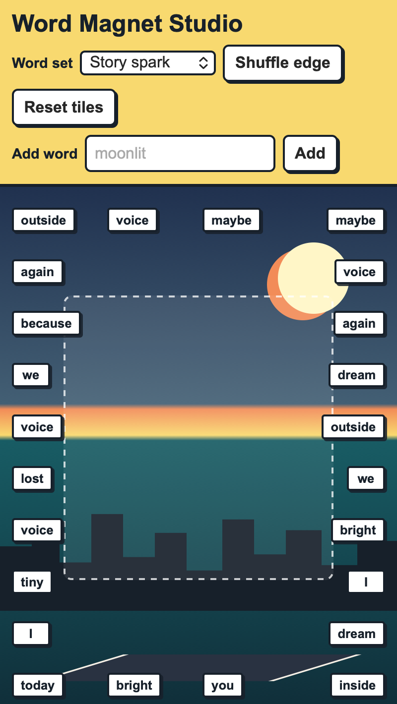

<h2 class="c-project-heading--task">Build the magnet board</h2>

Create the web page that will hold your word magnets and controls.

Open `index.html` and replace the starter code with this page structure.

--- code ---
---
language: html
filename: index.html
line_numbers: true
line_number_start: 1
line_highlights: 10-29
---
<!-- The page holds the controls and the board where magnets can move. -->
<main class="app">
  <header class="toolbar" aria-label="Word magnet controls">
    <h1>Word Magnet Studio</h1>

    <nav class="control-row">
      <label for="bank-select">Word set</label>
      <select id="bank-select"></select>
      <button id="shuffle-button" type="button">Shuffle edge</button>
      <button id="reset-button" type="button">Reset tiles</button>
    </nav>

    <form id="word-form" class="word-form">
      <label for="new-word">Add word</label>
      <input id="new-word" name="new-word" maxlength="18" autocomplete="off" placeholder="moonlit">
      <button type="submit">Add</button>
    </form>
  </header>

  <section id="board" class="board" aria-label="Dream city word magnet board">
    <section class="scene" aria-hidden="true">
      
      
      
    </section>
    <section class="message-zone" aria-hidden="true"></section>
    <section id="magnet-layer" class="magnet-layer"></section>
  </section>
</main>
--- /code ---

<h2 class="c-project-heading--task">Test</h2>

Run your project and check that the title, controls, and empty board appear.

  

