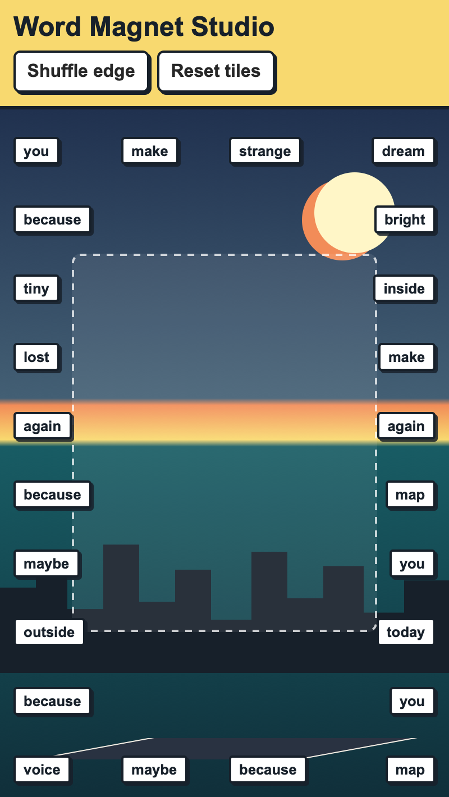

<h2 class="c-project-heading--task">Add a reset button</h2>

Create a button that sends the word magnets back to the edge of the board.

## Step 1
Add a `Reset tiles` button next to your shuffle button in `index.html`.

--- code ---
---
language: html
filename: index.html
line_numbers: true
line_number_start: 13
line_highlights: 15
---
    <nav class="control-row">
      <button id="shuffle-button" type="button">Shuffle edge</button>
      <button id="reset-button" type="button">Reset tiles</button>
    </nav>
--- /code ---

## Step 2
Add the reset code to `script.js`.

--- code ---
---
language: javascript
filename: script.js
line_numbers: true
line_number_start: 9
line_highlights:
---
const resetButton = document.querySelector("#reset-button");

function resetTiles() {
  magnetLayer.innerHTML = "";
  magnets = [];
  edgeSpots.forEach(makeMagnet);
}

resetButton.addEventListener("click", resetTiles);
--- /code ---

<h2 class="c-project-heading--task">Test</h2>

Drag some tiles into the middle, click Reset tiles, and check that new tiles appear around the edge.

  

