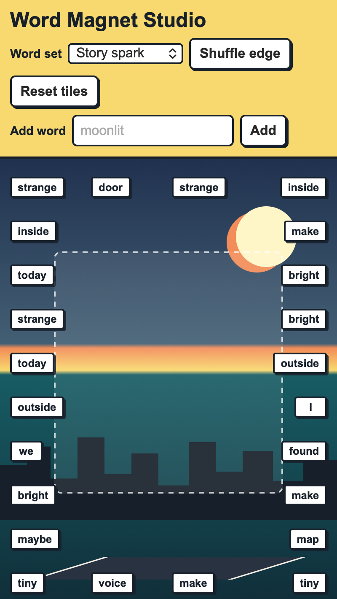

<h2 class="c-project-heading--task">Challenge</h2>

Add a form so someone can put one of their own words onto a tile.

## Step 1
Add a form to `index.html`. 

--- code ---
---
language: html
filename: index.html
line_numbers: true
line_number_start: 18
line_highlights: 1-5
---
<form id="word-form" class="word-form">
  <label for="new-word">Add word</label>
  <input id="new-word" name="new-word" maxlength="18" autocomplete="off" placeholder="moonlit">
  <button type="submit">Add</button>
</form>
--- /code ---

## Step 2
Connect the form in `script.js`.

--- code ---
---
language: javascript
filename: script.js
line_numbers: true
line_number_start: 130
line_highlights: 1-19
---
const wordForm = document.querySelector("#word-form");
const newWordInput = document.querySelector("#new-word");

wordForm.addEventListener("submit", (event) => {
  event.preventDefault();
  const newWord = newWordInput.value.trim().replace(/\s+/g, " ");

  if (newWord === "") {
    return;
  }

  if (!words.includes(newWord)) {
    words.push(newWord);
  }

  const magnet = magnets[Math.floor(Math.random() * magnets.length)];
  magnet.textContent = newWord;
  newWordInput.value = "";
});
--- /code ---

<h2 class="c-project-heading--task">Test</h2>

Type a word into the box, click Add, and check that your word appears on a tile.

  

