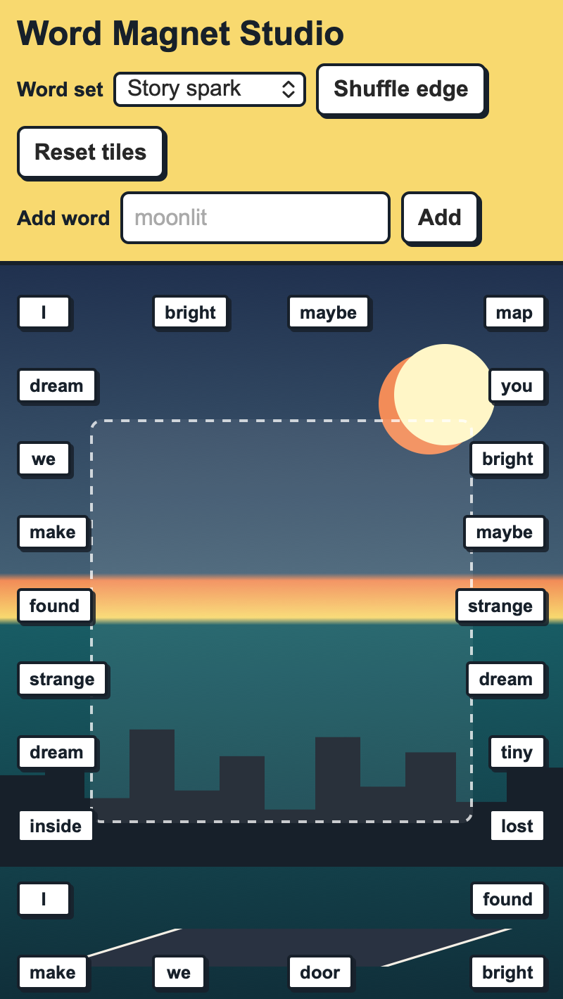

<h2 class="c-project-heading--task">Drag and change words</h2>

Make each word button draggable and let a click swap it for another word.

Add these functions to `script.js`, then replace your `makeMagnet` function with the version below.

--- code ---
---
language: javascript
filename: script.js
line_numbers: true
line_number_start: 27
line_highlights: 1-52
---
function randomiseMagnet(magnet) {
  magnet.textContent = randomWord();
}

function moveMagnet(magnet, left, top) {
  const boardBox = board.getBoundingClientRect();
  const maxLeft = boardBox.width - magnet.offsetWidth;
  const maxTop = boardBox.height - magnet.offsetHeight;
  magnet.style.right = "auto";
  magnet.style.left = `${Math.min(Math.max(left, 0), maxLeft)}px`;
  magnet.style.top = `${Math.min(Math.max(top, 0), maxTop)}px`;
}

function addDrag(magnet) {
  magnet.addEventListener("pointerdown", (event) => {
    event.preventDefault();
    magnet.setPointerCapture(event.pointerId);

    const boardBox = board.getBoundingClientRect();
    const magnetBox = magnet.getBoundingClientRect();
    const shiftX = event.clientX - magnetBox.left;
    const shiftY = event.clientY - magnetBox.top;
    const startX = event.clientX;
    const startY = event.clientY;

    magnet.classList.add("dragging");
    magnet.dataset.dragged = "false";

    function onPointerMove(moveEvent) {
      moveMagnet(magnet, moveEvent.clientX - boardBox.left - shiftX, moveEvent.clientY - boardBox.top - shiftY);
    }

    function onPointerUp(upEvent) {
      const distance = Math.hypot(upEvent.clientX - startX, upEvent.clientY - startY);
      magnet.dataset.dragged = distance > 6 ? "true" : "false";
      magnet.classList.remove("dragging");
      magnet.releasePointerCapture(upEvent.pointerId);
      magnet.removeEventListener("pointermove", onPointerMove);
    }

    magnet.addEventListener("pointermove", onPointerMove);
    magnet.addEventListener("pointerup", onPointerUp, { once: true });
  });
}

function makeMagnet(spot) {
  const magnet = document.createElement("button");
  magnet.type = "button";
  magnet.className = "magnet";
  magnet.textContent = randomWord();
  placeMagnet(magnet, spot);

  magnet.addEventListener("click", () => {
    if (magnet.dataset.dragged === "true") {
      magnet.dataset.dragged = "false";
      return;
    }
    randomiseMagnet(magnet);
  });

  addDrag(magnet);
  magnetLayer.append(magnet);
  magnets.push(magnet);
}
--- /code ---

<h2 class="c-project-heading--task">Test</h2>

Run your project, drag a tile into the middle, and click a tile to change its word.

  

