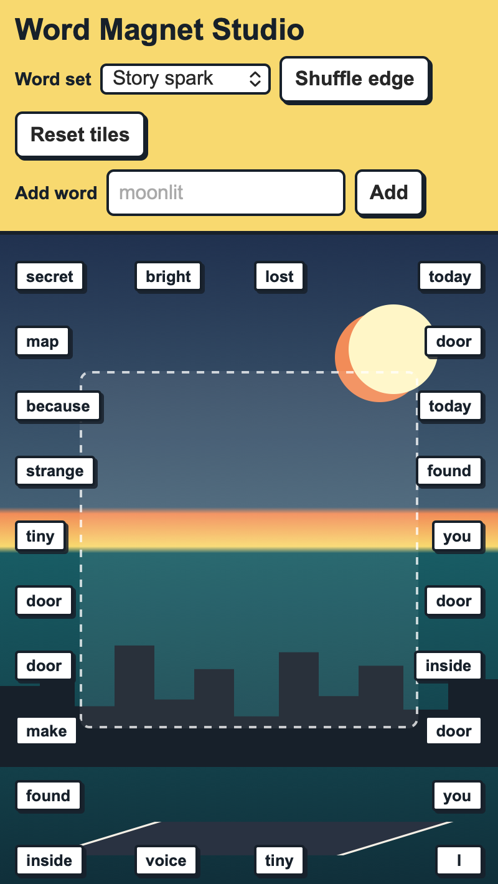

<h2 class="c-project-heading--task">Choose and add words</h2>

Connect the word set menu, shuffle button, reset button, and custom word form.

Replace the final `edgeSpots.forEach(makeMagnet);` line with this control code.

--- code ---
---
language: javascript
filename: script.js
line_numbers: true
line_number_start: 112
line_highlights: 1-41
---
function fillWordSetMenu() {
  Object.keys(wordBanks).forEach((name) => {
    const option = document.createElement("option");
    option.value = name;
    option.textContent = name;
    bankSelect.append(option);
  });
}

function resetTiles() {
  magnetLayer.innerHTML = "";
  magnets = [];
  edgeSpots.forEach(makeMagnet);
}

function shuffleWords() {
  magnets.forEach(randomiseMagnet);
}

fillWordSetMenu();
resetTiles();

bankSelect.addEventListener("change", () => {
  currentBank = bankSelect.value;
});

shuffleButton.addEventListener("click", shuffleWords);
resetButton.addEventListener("click", resetTiles);

wordForm.addEventListener("submit", (event) => {
  event.preventDefault();
  const newWord = newWordInput.value.trim().replace(/\s+/g, " ");

  if (newWord === "") {
    return;
  }

  wordBanks[currentBank].push(newWord);
  magnets[Math.floor(Math.random() * magnets.length)].textContent = newWord;
  newWordInput.value = "";
});
--- /code ---

<h2 class="c-project-heading--task">Test</h2>

Run your project, select a different word set, add a word, and check that it appears on a tile.

  

