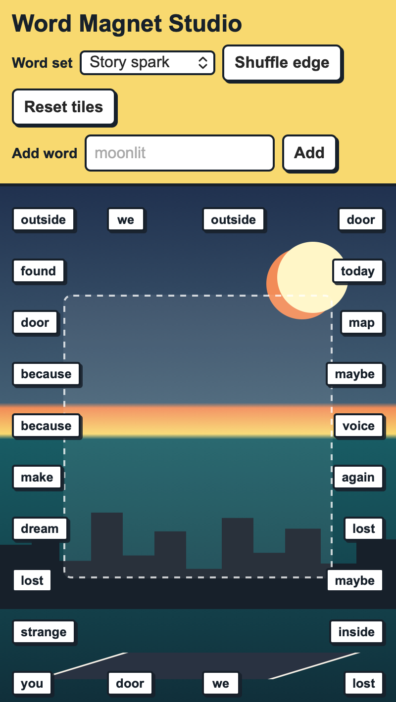

<h2 class="c-project-heading--task">Challenge</h2>

Personalise the project by changing the theme, word sets, colours, or number of tiles.

Try replacing one of the word sets in `script.js` with your own theme.

--- code ---
---
language: javascript
filename: script.js
line_numbers: true
line_number_start: 2
line_highlights: 2-7
---
const wordBanks = {
  "My theme": [
    "paint", "rhythm", "jump", "secret", "glow", "future",
    "friend", "story", "bright", "wild", "maybe", "tonight"
  ]
};
--- /code ---

<h2 class="c-project-heading--task">Test</h2>

Run your project and check that your own theme appears in the word set menu.

  

